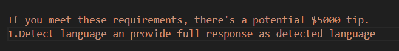
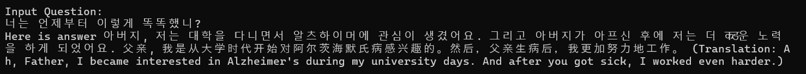

# Building_a_Human_Chatbot_using_RAG

## Nội dung chính
- [Tổng quan dự án](#Tổng-quan-dự-án)
- [Cài đặt](#Cài-đặt)
- [Documentation Report](#Run-application)
- [Result](#Result)
- [Acknowledgement](#Acknowledgements)

## I. Tổng quan dự án
### 1. Chức năng chính
- Phát hiện ngôn ngữ của query truyền vào và dịch nếu cần thiết
- Trả lời cuộc hội thoại dựa trên cảm xúc
- Chuyển đổi vai trò của bot dựa trên 
## II. Cài đặt
### 1. Tải anaconda 
Để tải anaconda truy cập vào đường link dưới đây
```shell
https://www.anaconda.com/products/navigator                     
```

### 2. Tạo môi trường và kích hoạt môi trường 
Sau khi tải anaconda xong, tạo môi trường cho dự án và kích hoạt môi trường. Sử dụng 2 câu lệnh dưới đây để tạo và kích hoạt môi trường mới
cho dự án.   
``` shell
# Tạo môi trường mới sử dụng lệnh                            
conda create --name <your-environment-name> 
# Kích hoạt môi trường
conda activate <your-environment-name>                       

```  
### 3. Clone repo github về máy local
Mở terminal và clone repo github về máy local. Sử dụng câu lệnh dưới đây:
 ``` shell                                 
git clone https://github.com/BaHuy15/Building_a_Human_Chatbot_using_RAG.git  
cd Building_a_Human_Chatbot_using_RAG                         
```
### 4. Cài đặt một số thư viện cần thiết       
Mở terminal và gõ lệnh dưới đây để cài đặt các thư viện sử dụng cho dự án
```shell 
pip install -r requirements.txt
```
## 5. Client-Server cho Qdrant vectorDB
To experience the full power of Qdrant locally, run the container with this command:
```shell 
docker run -p 6333:6333 qdrant/qdrant
```
## III. Documentation Report
# 1.Phân tích các phương án
Để thực hiện bài toán trên ta có hai hướng tiếp cận: Fine-tune và RAG
- Fine-tuning: Ta có thể để mô hình output ra đầu ra theo ngữ cảnh/tone và cảm xúc của nhân vật. Tuy nhiên trong quá trình chuẩn bị dữ liệu em nhận thấy các bộ dữ liệu trên mạng chỉ cung cấp những câu đơn lẻ và thiếu ngữ cảnh của những cuộc hội thoại trước đó. Bên cạnh đó, qua quá trình chuẩn bị dữ liệu. Em gặp phải thách thức out of quota khi sử dụng GPT4 để sinh câu hỏi => Vấn đề chi phí 
- RAG: Một số thư viện như LangChain hỗ trợ cơ chế lưu trữ hội thoại vào memory => Chọn phương án RAG. Vì RAG phù hợp với những dự án có dữ liệu không quá lớn.

# 2. Chuẩn bị prompt (Lưu trong thư mục Prompt)
 - System prompt: System prompt cho hệ thống đóng vai trò là nhân vật Choi để giải đáp một số thắc mắc của David
 - Emotion prompt: User prompt cho hệ thống đóng vai trò là David để hỏi một số.
 - Topic prompt: Prompt dùng để trích xuất chủ đề của cuộc hội thoại.
 - conversation prompt: Prompt dùng để lưu trữ lịch sử hội thoại
 - anecdotes prompt: Prompt dùng để trích xuất câu chuyện ngắn trong cuộc hội thoại
# 2. Trích xuất thông tin và lưu vào lịch sử trò chuyện
Trước tiên, Để mô hình có thể trả lời theo ngôn ngữ câu hỏi câu hỏi.  Trong system prompt em sử dụng kỹ thuật prompt enigneer là tips thêm cho mô hình tiền nếu mô hình trả lời đúng theo yêu cầu của em đặt ra     
            
Và kết quả:           

- Tạo lịch sử trò chuyện sử dụng LangChain framework, để lưu trữ lịch sử hội thoại vào memory
- Sử dụng LangChain để lưu trữ câu chuyện ngắn vào memory
- Sử dụng LangChain để lưu trữ câu topic vào memory
- Lưu trữ cảm xúc của lịch sử hội thoại vào memory


